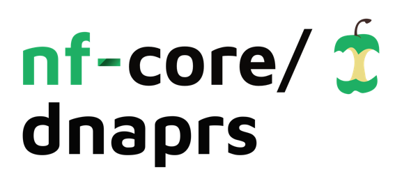
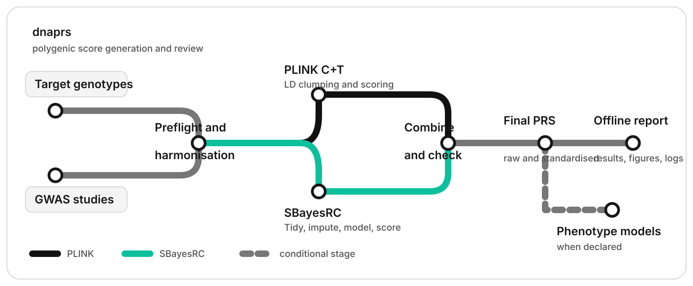

<p align="center">
  <picture>
    <source media="(prefers-color-scheme: dark)" srcset="docs/images/nf-core-dnaprs_logo_dark.png">
    
  </picture>
</p>

[](https://github.com/paulYRP/dnaprs/actions/workflows/nf-test.yml)
[](https://github.com/paulYRP/dnaprs/actions/workflows/linting.yml)
[](https://www.nextflow.io/)
[](https://github.com/nf-core/tools/releases/tag/4.1.0)
[](https://www.nf-test.com/)
[](LICENSE)

## Introduction

**nf-core/dnaprs** is a Nextflow pipeline for reproducible polygenic risk score (PRS)
generation from quality-controlled target genotypes and genome-wide association study
(GWAS) summary statistics. It supports two established scoring methods:

- PLINK 2 clumping and thresholding (C+T), using fixed settings and an independent
  linkage-disequilibrium (LD) reference;
- SBayesRC 0.2.6, using the authors' `tidy()`, `impute()`, `sbayesrc()`, and `prs()`
  sequence.

The workflow creates allele-explicit weights, scores each declared cohort, checks score
coverage, combines raw and standardised PRSs, and can fit prespecified phenotype-PRS
models. It produces a portable offline report with results, quantitative figures,
dictionaries, logs, and downloads.



1. Validate run parameters and the target, GWAS, reference, and phenotype-model
   manifests.
2. Harmonise each GWAS and prepare each quality-controlled target dataset without
   changing source files.
3. Generate PLINK C+T weights and/or SBayesRC posterior effects using declared reference
   resources.
4. Calculate one finite score per participant and record the variants used.
5. Save raw scores and within-cohort standardised scores.
6. Evaluate prespecified phenotype associations without using the phenotype to tune the
   PRS.
7. Build a self-contained report with contextual downloads and execution records.

Phenotype associations are research estimates. They do not turn a PRS into a clinical
risk prediction and are not used to select scoring settings.

## Usage

> [!NOTE]
> Install Java 17 or newer and Nextflow 25.10.4 or newer. Run the synthetic profile
> before using study data.

Test the complete R and report implementation from PowerShell:

```powershell
.\tests\smoke.ps1 -OutputDirectory ..\test\synthetic_analysis
```

Test the complete Nextflow graph from Linux or WSL:

```bash
nextflow-25.10.4 lint .
python3 -m nf_core pipelines lint --dir .
nf-test test tests/default.nf.test --ci
nextflow-25.10.4 run . -profile test_full -stub-run \
  --outdir ../test/nextflow_results \
  -work-dir ../test/nextflow_work
```

The tests check pipeline behavior and report generation. They do not provide biological
validation of a PRS.

Create a run configuration with the offline terminal assistant:

```bash
bin/dnaprs configure /path/to/workspace
bin/dnaprs check --params-file /path/to/workspace/runs/my_run/params.yaml
```

After reviewing the generated manifests and parameters, run locally:

```bash
docker build --pull --tag dnaprs:1.0.0 --file containers/Dockerfile .
nextflow-25.10.4 run . \
  -profile docker \
  -params-file /path/to/workspace/runs/my_run/params.yaml \
  --outdir results
```

The Docker profile uses the locally built `dnaprs:1.0.0` image. The image is not yet
claimed as a published registry image. Exact installation, verification, and synthetic
test commands are recorded in the [contributing guide](docs/CONTRIBUTING.md) and the
[container guide](containers/README.md).

Advanced users can write the three manifests and parameter YAML directly. See
[`docs/usage.md`](docs/usage.md) and the files under [`examples/`](examples/).

## Aquarius HPC

Submit the controller from the pipeline directory. Nextflow submits each scientific
process to PBS Pro and uses the versioned Aquarius modules defined by the pipeline.

```bash
cd /path/to/QPASST/dnaprs
export DNAPRS_PARAMS_FILE=runs/ukr/params.yaml
export DNAPRS_R_LIBS_USER=/path/to/fixed/R-4.4.1-library
export DNAPRS_WORK_DIR=/path/to/shared/dnaprs-work
export DNAPRS_OUTPUT_DIR=/path/to/shared/dnaprs-results
qsub aqua.pbs
```

Set `DNAPRS_RESUME=true` only to continue the same unchanged run with its existing work
directory and `.nextflow/cache`. Full instructions are in
[`docs/aqua.md`](docs/aqua.md).

## Pipeline output

Open `<output-dir>/<run-name>/reports/index.html` after the run finishes. The report can
contain Overview, Inputs, Target and GWAS, PLINK, SBayesRC, PRS, Phenotype, Dictionary,
and Logs pages. A method or phenotype page is included only when its analysis ran.
Tables, figures, and logs are downloadable from the section where they are described.
Quantitative figures are supplied as TIFF, PNG, and JPEG.

The main safeguards are:

- typed parameters and manifest validation before large computations;
- explicit genome build, ancestry, source columns, effect scale, and resource versions;
- no phenotype-based selection of variants, thresholds, or SBayesRC weights;
- read-only inputs and isolated Nextflow work directories;
- participant and variant-coverage checks for every score;
- input checksums, software versions, method logs, and Nextflow execution records;
- one output registry controlling publication, report downloads, and the data
  dictionary.

For a complete description of output files and their interpretation, see
[`docs/output.md`](docs/output.md).

## Documentation

- [Input and run instructions](docs/usage.md)
- [Output files and interpretation](docs/output.md)
- [Aquarius deployment](docs/aqua.md)
- [Container build](containers/README.md)
- [Contributing and testing](docs/CONTRIBUTING.md)
- [Software and method citations](CITATIONS.md)

## Citations

The software and method references required for a run are listed in
[`CITATIONS.md`](CITATIONS.md). Cite Nextflow and each selected PRS method.

## Licence

The dnaprs workflow code is released under the [MIT licence](LICENSE). PLINK, SBayesRC,
reference panels, GWAS files, and other external resources retain their own licences and
access conditions.
